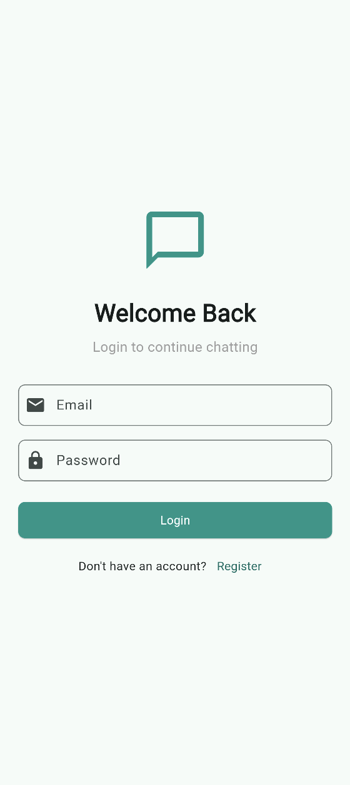
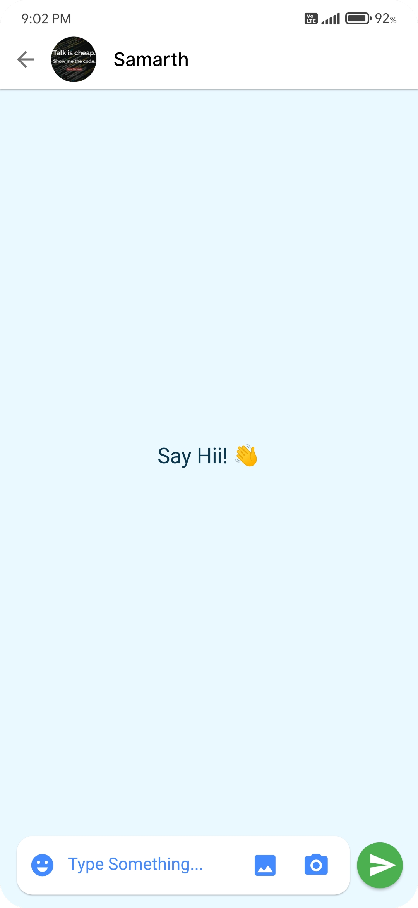
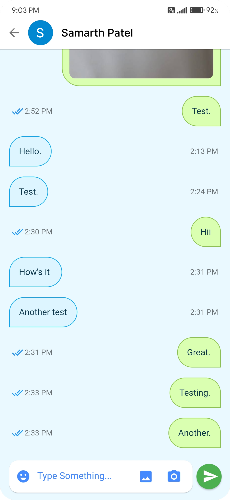
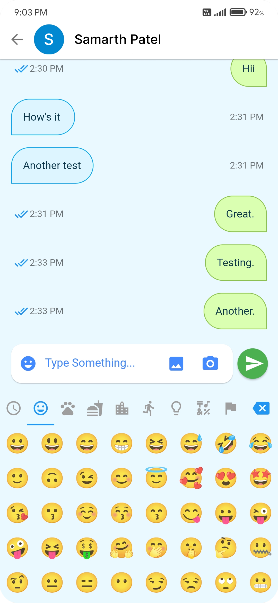
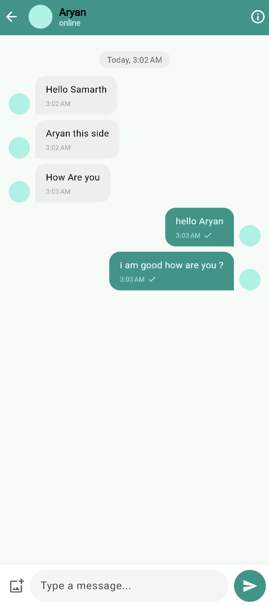
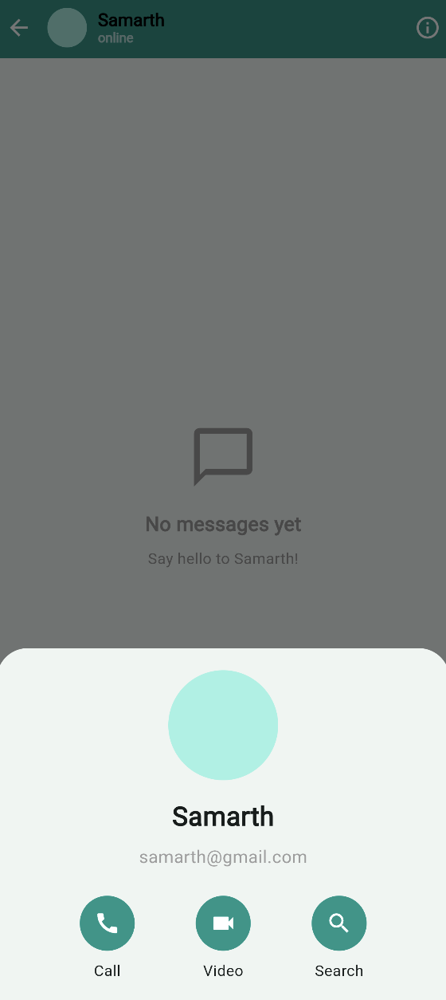

# Chat Application


**This Flutter-based chat application delivers a clean, modern UI and a robust real-time messaging experience. Originally built on Firebase, it now supports WebSocket communication, enhancing responsiveness and scalability for real-time interactions.**

**The app is designed to run smoothly across Android, iOS, web, and desktop environments, making it a versatile solution for personal or team communication.**


## 📂 Repository Structure

> Here's an overview of the project's directory structure:

```
Chat-Application-Flutter/
├── android/                  # Android platform-specific code
├── assets/                   # Images, fonts, and other static resources
├── ios/                      # iOS platform-specific code
├── lib/                      # Dart code for the application
│   ├── models/               # Data models (User, Message, etc.)
│   ├── providers/            # State management providers
│   ├── services/             # Business logic and API services
│   ├── screens/              # UI screens (ChatScreen, LoginScreen, etc.)
│   ├── widgets/              # Reusable UI components
│   └── main.dart             # Entry point of the application
├── web/                      # Web platform-specific code
├── .gitignore                # Git ignore file
├── firebase.json             # Firebase configuration
├── pubspec.yaml              # Project dependencies and metadata
└── README.md                 # Project documentation
```

## ✨ Features:

- Display only known users or contacts.
- Real-time messaging (with Firebase).
- Email Sign-In (no account or mobile number needed).
- Add users by email ID.
- Simple user profiles (with photo, about, last-seen, created-at).
- Message read status.
- Audio and Video Call Featuers
- Message notifications (push notifications).
- Sleek UI with new Material Widgets.
- **And much more...**


## 🌟 What's New?

### 🔌 WebSocket Integration

- The app now supports communication via WebSockets, enabling faster, bidirectional data exchange. This significantly reduces latency, making conversations feel instantaneous. The WebSocket layer is scalable, lightweight, and easily extendable to support group chats, typing indicators, and live presence tracking.


## 📸 Screenshots:

**Actual app looks even better! 😃**

<kbd>
  
  
  
  
  
  
  
</kbd>


## 🌐 Cross-Platform Support

- ✅ Android & iOS
- ✅ Web (Flutter Web)
- ✅ Linux, macOS, Windows (Flutter Desktop)


## 🧠 AI Chatbot (Google Gemini) Setup:

To use the **Gemini AI Chatbot** feature, you need to provide your own API key.  
Create an API key by visiting [Google AI Studio](https://aistudio.google.com/app/apikey).